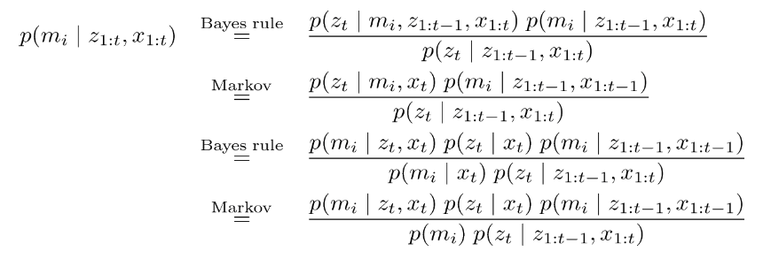
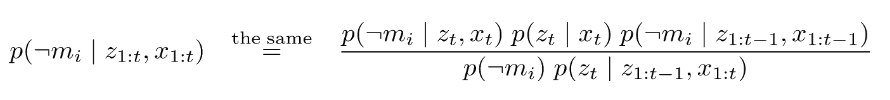
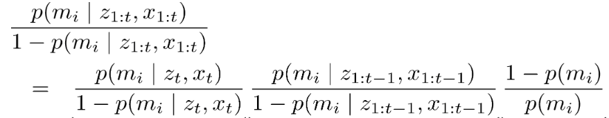

## CS401–Intelligent Robots Spring 2019 Midterm Test

**name: 黄玉安** **no:11610303**

#### P I

1.D
2.B (since :note 2, 39 )
3.C (note 3)
4.B
5.D (Particle filters are a way to efficiently represent non-Gaussiandistribution, note , 3)
6.D
7.A (The occupancy model represents whether or not a cell is occupied by anobject, 本文介绍了占据栅格地图的表示方法和利用激光传感器构建占据栅格地图的方法。但是，我们不难发现，使用的数据中机器人的位置和朝向是给定的。然而在实际的应用中，机器人不仅需要为未知环境构建地图，还要在未知环境中定位（Localization）以完成其他任务。)
8.A
9.B
10.C (not the distribution of noise)

#### P II

1. we know p(z=open|x1=open) = 1-0.3 =0.7,  p(z=closed|x1=closed) = 1-0.2 = 0.8, 
	p(z=open|x2=open) = 0.8,  p(z=closed|x2=closed) = 0.8,
(1) 

$$
\begin{align}
 &p(x1=open | z=open) \\
=& \frac {p(z=open | x1=open) * p(x1=open)} {    
 (p(z=open|x1=open)*p(x1=open)+p(z=open|x1=close)*p(x1=close)) }\\
=&0.7 * 0.5/(0.7 * 0.5+0.2 * 0.5) = 7/9
\end{align}
$$

$$
\begin{align}
& p(x2=open | z=open) \\
= &\frac {p(z=open | x2=open) * p(x2=open) } { (p(z=open|x2=open)*p(x2=open)+p(z=open|x2=close)*p(x2=close))} \\
=& 0.8 * 0.5/(0.8 * 0.5+0.2 * 0.5) = 4/5
\end{align}
$$

(2) 
$$
\begin{align}
 & p(x1=close, x2=close | z1=open, z2=open)\\
=& p(x1=close | z1=open) * p(x2=close | z2=open)\\
=& (1 - p(x1=open | z1=open)) * (1 - p(x2=open | z2=open))\\
=& (1-7/9)(1-4/5) = 2/45
\end{align}
$$

2.

Markov assumption: zn is independent of z1, ..., zn-1 if we know x.

So, 
$$
\begin{align}
 & p(x_t| u1, z1, u2, z2,..., u_t, z_t, m)\\
=& \eta p(z_t|x_t, u_{1:t-1}, z_{1:t-1}, m) * p(x_t| u_{1:t-1},z_{1:t-1}, m)\\
=& \eta p(z_t|x_t, m) * \int p(x_t| x_{t-1}, u_{1:t-1}, z_{1:t-1}, m) *  p(x_{t-1}| u_{1:t-1}, z_{1:t-1}, m) dx_{t-1}\\
=& \eta p(z_t|x_t, m) * \int p(x_t| x_{t-1}, u_{t-1}, m) *  p(x_{t-1}| u_{1:t-1}, z_{1:t-1}, m) dx_{t-1}\\
=& \eta p(z_t|x_t, m) * \int p(x_t| x_{t-1}, u_t-1, m) *  Bel(x_{t-1})dx_{t-1}
\end{align}
$$

More, Bel(x1) = p(x1), so we can get all `p(x_t| u1, z1, u2, z2,..., u_t, z_t, m)`

#### P III

1.

For velocity model, it use this algorithm, here $x_{t-1} = (x, y, \theta)^T, x_t=(x', y', \theta')^T, u_t = (v, \omega)^T$

The return value is the value of $p(x_{t+1}|x_t, u_t)$.

For odometry model

Here, control $u_t,= (\bar x_{t-1}, \bar x_t)^T, \bar x_{t-1} = (\bar x, \bar y, \bar \theta)^T, u_t = (v, \omega)^T$.

the value of $p(x_{t+1}|x_t, u_t)$ is p1 * p2 * p3.

**Similarity**: for both motion models, we presented two types of implementations, one in which thr $p(x_t| u_t, x_{t-1})$ is calculated in closed form, and one that enables us to generate samples from $p(x_t| u_t, x_{t-1})$.

**Difference**: 1. velocity model add a third moise paremeter, expressed as a noisy "final votation".

2. Odemetry: the readings are technically not controls, use them just like controls.

2.

For velocity:

For odometry:

**Similarity**: Both of them are easy to implement.

**Differenece**: velocity reuire to calculate the inverse of the physical motion model; Odemetry side-steps the need for an inverse model.

#### P IV

1. Bean-based sensors: 

    

   Scan-based sensors:

   

Bean-bases sensors suffers two major drawbacks. (1) lack of smoothness. (2) computational involved. Scan-based sensors overcomes these limitations. It does not compute a conditional probability relative to any meaningful generative model of the physics of sensors.

2.

Detection probability: 

generate samples:

#### P V

1. ${X_{t+1}| x_t } \in G(Ax_t+u_t, R)$, 

   thus,
   $$
   \mu_{x_{t+1}| x_t} = A \mu_t + u_t \\
\Sigma_{x_{t+1}|x_t} = A \Sigma_t A^T + R
   $$

2.

multiply by $C^TQ^{-1}$, then  $C^TQ^{-1}z = C^TQ^{-1}Cx - C^TQ^{-1}m + C^TQ^{-1}v $

then $(C^TQ^{-1}C)^{-1}C^TQ^{-1}z  = x - (C^TQ^{-1}C)^{-1}C^TQ^{-1}m + (C^TQ^{-1}C)^{-1}C^TQ^{-1}v $

let $\bar C = (C^TQ^{-1}C)^{-1}C^TQ^{-1}$, so $x^* = \bar C z + \bar C m - \bar C v$

thus
$$
\mu_{x|z} =(C^TQ^{-1}C)^{-1}C^TQ^{-1} z + (C^TQ^{-1}C)^{-1}C^TQ^{-1} m \\
\Sigma_{x|z} = \bar C Q \bar C^T  = (C^T Q^{-1} C)^{-1}
$$

3.
$$
\Sigma_{t+1}^{-1}= (C^T Q^{-1} C) + (A \Sigma_t A^T + R)^{-1}\\
\Sigma_{t+1}= \frac 1{(C^T Q^{-1} C) + (A \Sigma_t A^T + R)^{-1}}\\
$$

And for mean value of it:
$$
\begin {align}
\mu_{t+1} = & (\Sigma_1 u_1 + \Sigma_2 u_2) \Sigma_{t+1}\\
= & \frac{(A \mu_t + u_t)(A \Sigma_t A^T + R) + ((C^TQ^{-1}C)^{-1}C^TQ^{-1} z + (C^TQ^{-1}C)^{-1}C^TQ^{-1} m)(C^T Q^{-1} C)^{-1}} {(C^T Q^{-1} C) + (A \Sigma_t A^T + R)^{-1}}
\end{align}
$$

#### P VI

- 1.

For $Bel(m^{[i]}_t) = p(m_i | z_{1:t}, x_{1:t})$, It can been clculated below:

 

And the same as the opposite

Thus: 

And for log-odds representation:
$$
l(x) = log\ \frac {p(x)}{1 -p(x)}
$$
using this formula to it, the result is:

- 2.

- 3

#### P VII

1.

1. get a uniform sample (x~s~, y~s~) where X~s~ from $x_s \in [x_{m2} - r_2, x_{m2} + r_2]$,  $y_s \in [0, r]$.
2. sample c from $[0, f_{max}]$
3. if $f(x_s, y_s) > c$ , keep the sample, otherwise reject this sample

2.

	1. for all sample:
 	2.  sample x~i~
 	3. calculate the weight according to p(r1|x) and p(r3|x), multiply them
 	4. after sampling, normalize sample's weight to 1

3.

1. genetate cdf, for all n sample, let c~i~ = c~i-1~ + w~i~, 
2. initial a threadhold $u_i \in U[0, n^{-1}]$, i=1, S' = none
3. for all samples
4. ​     while($u_j > c_i$)
5. ​         i = i+1
6. ​     $S' = S' + {<x_i, n^{-1}>}$ 
7. ​     $u_{j+1} = u_j + n^{-1}$
8. return S'

#### P VIII

To finish tasks, robots have to be able to accommodate the enormous uncertainty that exists in the physical world. There is a number of factors that contribute to a robot's uncertainty.

- First and foremost, robot environments are inherently unpredictable,
- Sensors are limited in what they can perceive.
- Some uncertainty is caused by the robot's software.
- Uncertainty is futher created through algorithmic approximations. Robots are real-time systems. This limits the amout of computaion that can be carried out.

Since the complex of real physical world, along with  robot moving into the open world,  use probabilisitic models to represent uncertainty is the most important thing.