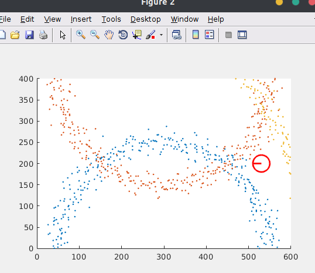
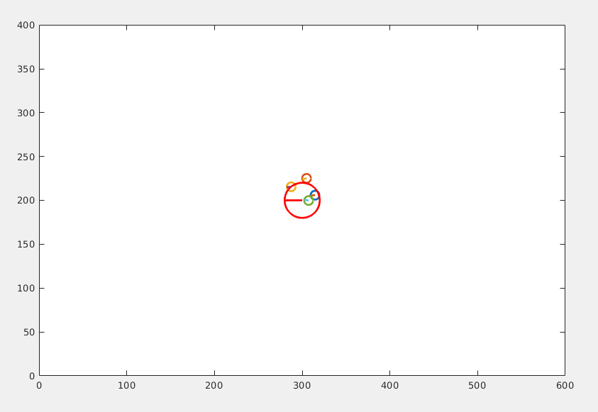
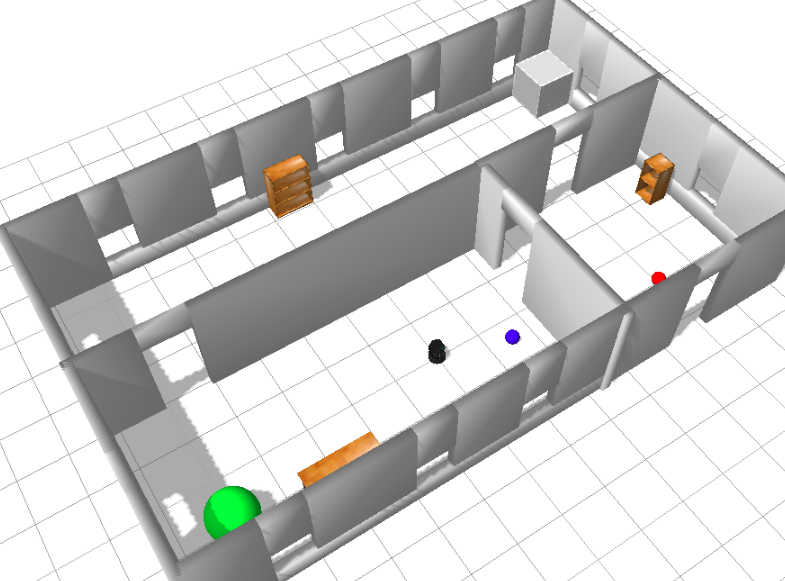

# Homework 8 Report

11610303 黄玉安

#### Problem 1: Given the following landmark models, please use importance sampling and resampling techniques to estimate the robot location.


For every landmark, we can give some noise to the distance between robot and landmark, then we can get some initial samples. 

```matlab
 mu = r;
 r = normrnd(mu, sigma);
 samples(i, 1) = r * cos(t(i)) + xc;  
 samples(i, 2) = r * sin(t(i)) + yc; 
```

It show below.



Then we use the algorithm to do importance sampling. The weight was calculate by this algorithm. For problem 1, the orientation part was ignored and Z_fp was zero.


After get weight, use this code to resampling

```matlab
for i=2:length(allsample)
    allsample(i, 3) = allsample(i-1, 3) + allsample(i, 3);
end

for i=1:length(allsample)
    allsample(i, 3) = allsample(i, 3)/allsample(length(allsample), 3);
end

N = 50;
res = zeros(N, 2);
resnum = 1;
for i=1:N
    chooseyou = rand(1);
    for j=1:length(allsample)
        if allsample(j, 3) > chooseyou
            res(resnum, 1) = allsample(j, 1);
            res(resnum, 2) = allsample(j, 2);
            resnum = resnum + 1;
            break;
        end
    end
end
```

The result is in `res`, the figure was shown below:


#### Problem 2: Given the following Landmark models, please use importance sampling and resampling techniques to estimate the robot position and orientation.

THis problem has 6 landmark, use similar method to give noise to the distance and orientation between robot and landmark. 


Calculate the weight of each sample, the weight for each landmark should be multiplied. 

And then, do the resampling. The result was show below. 




#### Problem 3: Given a map and the ultrasound sensor model, please use importance sampling and resampling techniques to estimate the robot location and path.

Open gazebo and run the matlab script:




The result was show below.

The initial sample:


After 9 update:


After 55 update, robot can find its position.


