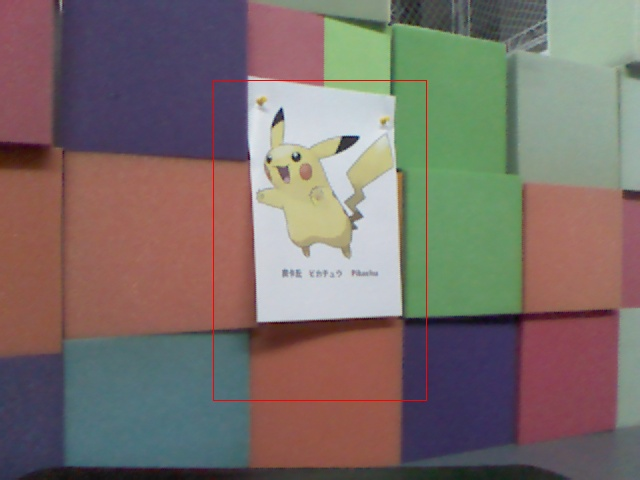
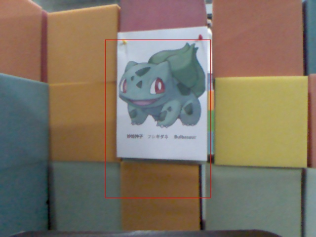
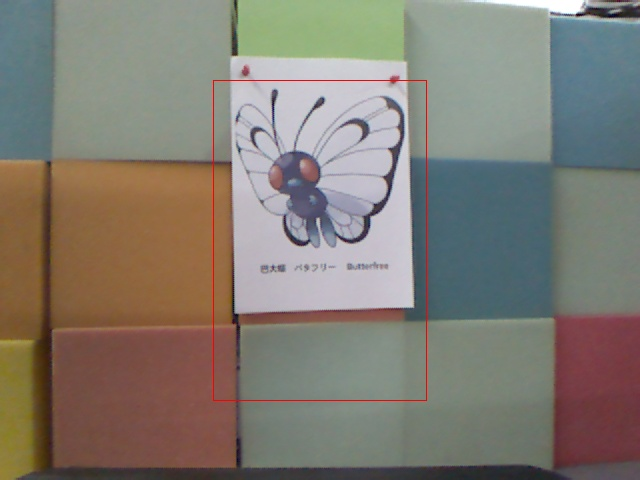
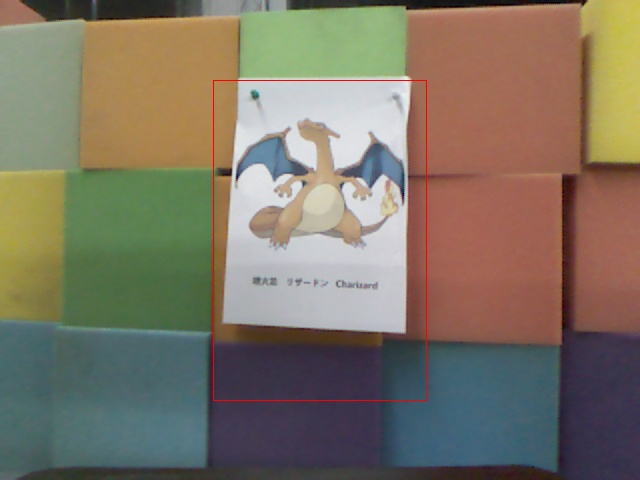
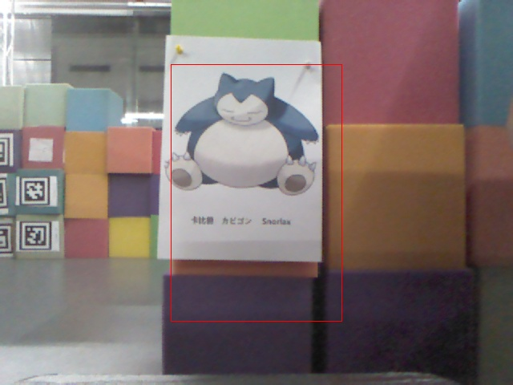
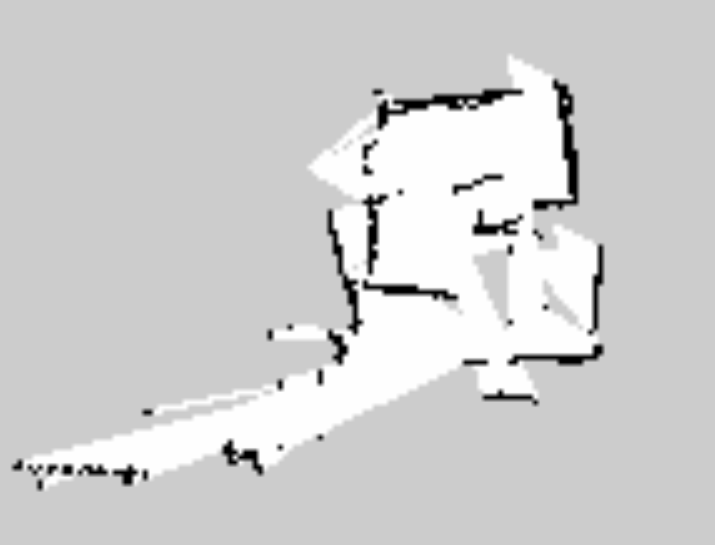

##  Project3 Pokemon Go

-	王舒心 11611815
-	王凯 11612909
-	陈闽11612602
-	潘天赐11610528
-	欧阳奕成11610313
-	黄玉安11610303

#### **Project Design**

1. 远程控制机器人走迷宫的实现

   - 我们使用提供的`pokemon\_searching`中的代码，其订阅了`/camera/rgb/image\_raw`节点，可以在远程获得机器人彩色摄像头所采集的画面。
   - 用另一台电脑远程访问机器人所连接的电脑，根据摄像头返回的图像，利用`keyboard_teleop keyboard-teleop.launch`控制机器人的运动。

2. 调整机器人与Pokemon之间的距离

   - 为了成功捕捉Pokemon，需要机器人能够自动调整与Pokemon之间的距离，相关方法实现在了`pokemon\_catching.cpp`中。
   - 我们首先控制机器人的视野对准Pokemon的中心，接着运行`pokemon\_catching`
   - 我们订阅了`/camera/depth/image\_raw`节点，获取图像深度信息。我们使用图像最中心点的距离作为标准来调整机器人的位置

   ```cpp
   image_transport::Subscriber sub = 
   	it.subscribe("/camera/depth/image_raw", 1, imageCallback);
   ```

   - 我们根据得出的距离判断机器人是否在合适的位置(我们选取的范围是50-58cm)，如果在区间之外，我们通过publish消息到`/cmd_vel_mux/input/teleop`节点使机器人朝对应的方向进行移动。
   - 当机器人具Pokemon的距离在500-580(mm)内时，即时订阅并保存`/pokemon_go/searcher`中获得的图像(已有红框)，退出程序。

3. 建图

   - 我们使用gmapping对迷宫进行建图。

#### **Result**

1. 我们所实现的节点可以实现自动调整小车到Pokemon距离为50-60cm之间

2. 将Pokemon抓住(放入红框中)：

   1. 皮卡丘
   2. 妙蛙种子
   3. 巴大蝴
   4. 喷火龙
   5. 卡比兽

3.走完迷宫后建的图:





#### Problem

在实验中, 未开始建图时运行openni.launch来获得图像的深度信息,和之后运行gmapping_demo.launch建图产生冲突。

原因: 二者都会自动开启了freenect(Kinect) 。重复启动会导致崩溃。

解决办法: 只运行gmapping_demo.launch来获得深度信息和建图。

#### Conclusion

通过这次抓pokemon的project, 我们学到了如何创建自己的节点, 如何在节点中订阅Topic和发布某个Topic的消息。